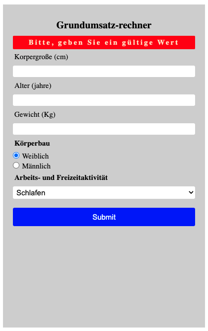
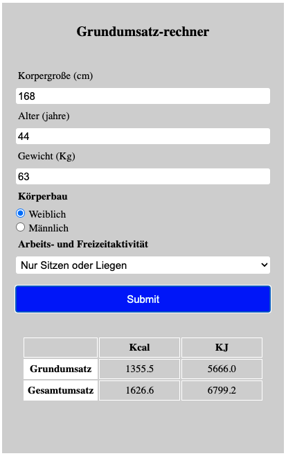
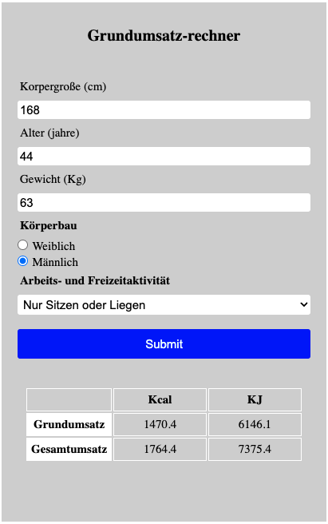

# calorie-calculator

# [GitHub Pages Deployment](https://mariariosnavarro.github.io/calorie-calculator/)

- I use the Harris Benedict Formula

- Weight are in Kg, Height in cm and Age in Years

- PAL = Physical Activity Level

- PAL Values I use -> almost-no-activity(0.95),very-little(1.2), little(1.5),medium(1.7), hard(1.9),very-hard(2.2)

- 1 kcal = 4,184 KJ (I round and use 4.18)

- Basal metabolic rate is in Kcal

- the Total turnover is the Basal metabolic rate x PAL

- Harris Benedict Formula for female that I use:

```

Female Basal metabolic rate = 655.1 + (9.6 x Weight) + (1.8 x Height) – (4.7 x Age)

```

- Harris Benedict Formula for male that I use:

```

Male Basal metabolic rate = 66.47 + (13.7 x Weight) + (5 x Height) – (6.8 x Age)

```

- TEST DATA = 'female' , PAL (very-little)(1.2), weight = 63, height = 168, age = 44

```

Female Basal metabolic rate TEST = 655.1 + (9.6 x 63) + (1.8 x 168) – (4.7 x 44)= 1355,5

Total turnover TEST = Female Basal metabolic rate TEST x PAL(1.2) = 1626.6.

```

<div>





</div>
